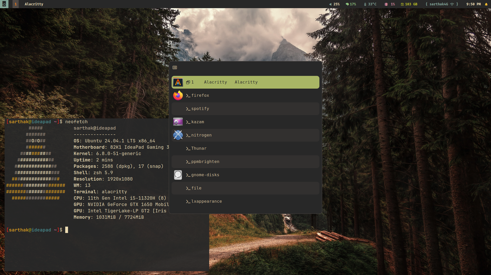

# 🚀 Unix Market Dotfiles

A carefully curated collection of dotfiles for a minimal yet powerful Linux setup featuring i3-gaps, Polybar, Rofi, and Alacritty - all themed with the beautiful Gruvbox color scheme.


## 🎨 Preview



## ✨ Features

- **Window Manager**: i3-gaps with custom keybindings and workspace management
- **Terminal**: Alacritty with Gruvbox theme and JetBrains Mono Nerd Font
- **Application Launcher**: Rofi with custom Gruvbox Material theme
- **Status Bar**: Polybar with system monitoring and custom modules
- **Color Scheme**: Gruvbox dark theme consistently applied across all components
- **Compositor**: Compton for smooth transitions and transparency effects

## 📦 Requirements

Before proceeding with the installation, ensure you have the following packages installed:

```bash
# Core components
i3-gaps
polybar
rofi
alacritty
compton
nitrogen

# Additional utilities
thunar
firefox
pavucontrol
networkmanager
pulseaudio
xss-lock
nm-applet

# Fonts
jetbrains-mono-nerd-font
fira-code-nerd-font
```

## 🛠️ Installation

1. **Clone the repository**:
```bash
git clone https://github.com/unix-market/i3-gruvbox.git
cd i3-gruvbox
```

2. **Create necessary directories**:
```bash
mkdir -p ~/.config/{i3,polybar,alacritty,rofi}
```

3. **Copy configuration files**:
```bash
# i3 config
cd i3
cp config ~/.config/i3/

# Polybar
cd polybar
cp config.ini ~/.config/polybar/
cp launch.sh ~/.config/polybar/
chmod +x ~/.config/polybar/launch.sh

# Alacritty
cd alacritty
cp alacritty.toml ~/.config/alacritty/

# Rofi
cd rofi
cp config.rasi ~/.config/rofi/
cp gruvbox-material.rasi ~/.config/rofi/
```

4. **Set up scripts**:
```bash
mkdir -p ~/.local/share/scripts
cd scripts
cp shutdown.sh ~/.local/share/scripts/
chmod +x ~/.local/share/scripts/shutdown.sh
```

## ⌨️ Keybindings

### Window Management
- `$mod + Enter` - Open terminal (Alacritty)
- `$mod + Shift + q` - Close focused window
- `$mod + h/v` - Split horizontal/vertical
- `$mod + f` - Toggle fullscreen
- `$mod + Shift + space` - Toggle floating

### Applications
- `$mod + d` - Open Rofi
- `$mod + Shift + w` - Open Thunar
- `$mod + Shift + f` - Open Firefox
- `$mod + Shift + s` - Open Spotify
- `$mod + b` - Open OBS
- `$mod + c` - Open VS Code
- `$mod + Shift + v` - Open virt-manager

### Workspaces
- `$mod + (1-0)` - Switch to workspace 1-10
- `$mod + Shift + (1-0)` - Move container to workspace 1-10

## 🎨 Customization

### Alacritty
The terminal is configured with:
- JetBrains Mono Nerd Font
- Gruvbox dark theme
- 95% opacity
- Custom padding

### Polybar
Features modules for:
- Workspaces
- Window title
- System monitoring (CPU, Memory, Temperature)
- Network status
- Volume control
- Battery
- Date/Time
- Custom power menu

### Rofi
Customized with:
- Gruvbox Material theme
- Icons support
- Custom prompt symbols
- Rounded corners
- Smooth transitions

## 📝 Notes

- The configurations use Gruvbox dark theme consistently across all components
- Font requirements: JetBrains Mono Nerd Font and FiraCode Nerd Font
- Make sure to have `nitrogen` installed for wallpaper management
- System notifications are handled through `dunst`

## 🤝 Contributing

Contributions are welcome! Please feel free to submit a Pull Request.

## 📄 License

This project is licensed under the GNU General Public License v3.0 - see the [LICENSE](LICENSE) file for details.

## 🙏 Acknowledgments

- Gruvbox theme creators
- i3wm community
- Polybar contributors
- Rofi developers
